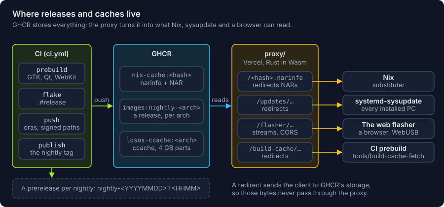

# Releases and GHCR

`nix build .#release` writes a flat directory:

```
losos-desktop_<v>_x86_64.efi                        the UKI sysupdate installs
losos-desktop_<v>_usr-x86-64_<uuid>.raw.xz          /usr for a sysupdate slot
losos-desktop_<v>_usr-x86-64-verity_<uuid>.raw.xz   its hash tree
losos-desktop_<v>.linux, .initrd, .grub             the UKI's kernel, initrd and
                                                    command line, for GRUB on a
                                                    BIOS PC, x86_64 only
losos-desktop_<v>_x86_64.raw.xz                     the disk image
losos-desktop_<v>_x86_64-installer.iso              the installer
losos-desktop_<v>_x86_64-windows-installer.exe      the installer for Windows, x86_64 only
losos-desktop_<v>_x86_64.qcow2                      the disk image, for a VM
SHA256SUMS
```

CI pushes it to GHCR as one OCI artifact per architecture with `oras`, and
`proxy/` serves the newest one to sysupdate, which cannot fetch from an OCI
registry itself (see [Binary cache](binary-cache.md)). The publish job then
creates a GitHub release of its own for that run, tagged
`nightly-<YYYYMMDD>T<HHMM>` from the version (`20261010.175322` is
`nightly-20261010T1753`) and marked a prerelease. It carries both
architectures' files, the update images, disk images, installer ISOs and the
[Windows installer](windows-installer.md), all but the qcow2 images, which
are the disk image again uncompressed. Each architecture's signed manifest
goes beside them as `SHA256SUMS-<arch>` and `SHA256SUMS-<arch>.gpg`.

GitHub rejects a release asset of 2 GiB or more, and `/usr` and the disk
image are past that, so such a file is uploaded in 2000 MiB parts,
`<file>.part-00` on; `cat <file>.part-* > <file>` gives back the file its line
of `SHA256SUMS-<arch>` names. That is also why sysupdate keeps reading
through the proxy rather than from the release.

A release is created once and never edited, so the repository can make
releases immutable. A re-run of the same commit finds its tag taken and
publishes nothing. There is no moving `nightly` release: GitHub refuses to
reuse the tag of a deleted immutable release, so it could not be replaced.

A tagged release is a run of `ci` started by hand (Actions, ci, Run
workflow) on the commit to release, with a **tag** such as `v0.1.0` and a
**title** such as `LosOS 0.1`. The run checks the tag first and fails within
a minute if it is malformed, starts with `nightly`, or is already released.
Otherwise it builds the commit, mostly from the cache, and publishes the same
files as a nightly would, as a full release rather than a prerelease. It
leaves the channel's GHCR tags alone, so installed systems keep following
the nightlies. A run started by hand without a tag publishes a nightly.



The `/usr` halves are cut out of the finished disk image at the offsets repart
reported, not built a second time, so the bytes sysupdate installs are the
bytes the image boots. Each name carries its partition's UUID, which sysupdate
reads with `@u` and gives the partition it writes. The initrd finds `/usr` by
the UUIDs repart derived from `usrhash=`, so a slot that kept the random UUID
repart created it with would hold the right bytes and never be found.
